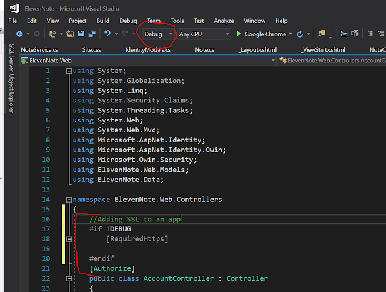

# 13.2: SSL
---
### Add SSL for Release Builds
SSL (Secure Sockets Layer) is a security technology that encrypts communication between a web browser and a server, using HTTPS (HTTP Secure) instead of HTTP (Hypertext Transfer Protocol). Here we will set the app up to require HTTPS unless we are in debug mode.

1. Open **ElevenNote.Web -> Controllers -> AccountController**
2. Add this annotation above the routes and 

    ```cs
    namespace ElevenNote.Web.Controllers
    {

    #if !DEBUG
        [RequireHttps]
    
    #endif
    [Authorize]
    public class AccountController : Controller
    ```
    
    This code includes what are called `#if` and `#endif` preprocessor directives. These act essentially like a standard if statement but are used for determining some things at the beginning of compiling the code instead of while running it. An `#if` directive must always be followed at some point by an `#endif`. Here's [the Microsoft documentation](https://docs.microsoft.com/en-us/dotnet/csharp/language-reference/preprocessor-directives/) on preprocessor directives in C#, if you're interested.

3. Change the tab from **Debug** to **Release**. Notice the code is commented/un-commented depending on the setting.

    

4. Set the drop-down back to **Debug** and 

[Next,](../14-WebAPI/14.0-WebAPISetup.md) we'll set up the WebAPI project.
