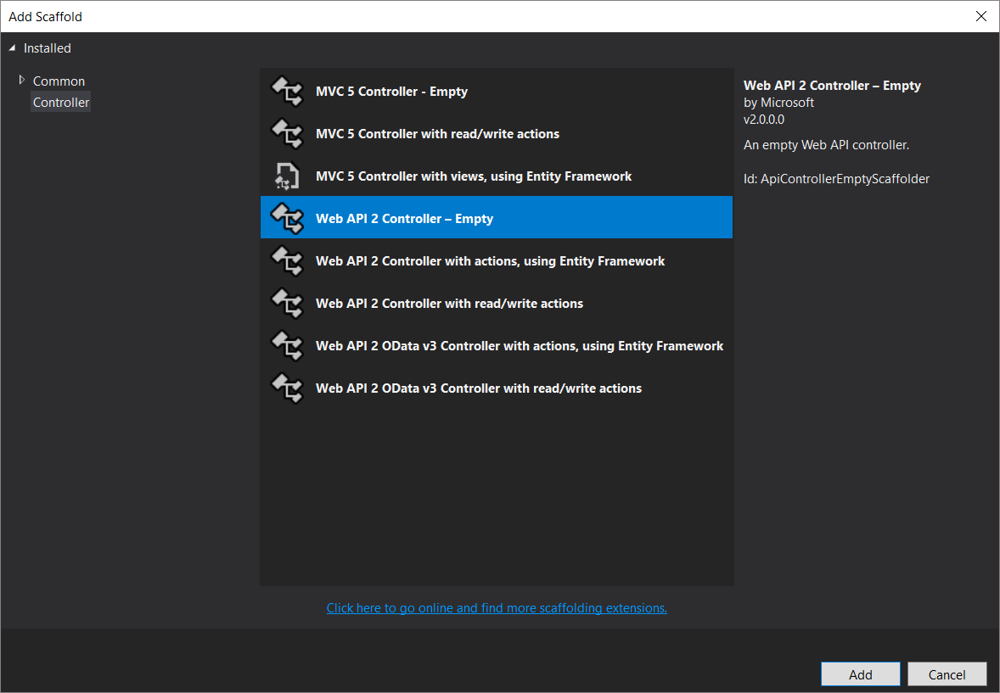

# PART 15: API CONTROLLER
---
### Add an API Controller
1. Stop the app
2. Right click on **ElevenNote.WebAPI -> Controllers** and click **Add -> Controller**
3. Select **Web Api 2 Controller - Empty**
4. Name it **NoteController**

5. Add an `[Authorize]` attribute tag at the top
6. Inside the controller, add a method that creates a `NoteService` similar to our method in the `ElevenNote.Web` MVC project

    ```cs
    namespace ElevenNote.WebAPI.Controllers
    {
        [Authorize]
        public class NoteController : ApiController
        {
            private NoteService CreateNoteService()
            {
                var userId = Guid.Parse(User.Identity.GetUserId());
                var noteService = new NoteService(userId);
                return noteService;
            }
        }
    }
    ```
7. `CTRL .` to bring in the using statement for the `NoteService` project and Microsoft.Asp.Net.Identity
8. This will allow us to reuse our `NoteService` in the methods for the API project, much like we did in the MVC project
9. Above the service method, write a method that uses the Service:

    ```cs
    namespace ElevenNote.WebAPI.Controllers
    {
        [Authorize]
        public class NoteController : ApiController
        {
            public IHttpActionResult Get()
            {
                NoteService noteService = CreateNoteService();
                var notes = noteService.GetNotes();
                return Ok(notes);
            }

            private NoteService CreateNoteService()
            {
                var userId = Guid.Parse(User.Identity.GetUserId());
    ```
10. `CTRL .` to bring in the using statement and then 

[Next,](15.1-PostmanGetNotes.md) we'll test getting notes in Postman.
