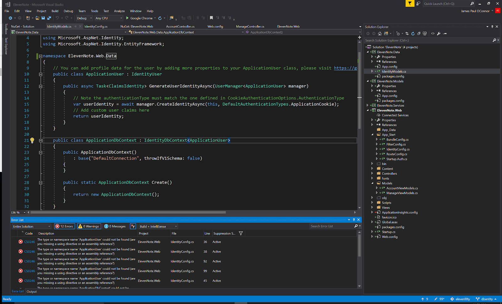

# 2.1: ENTITY FRAMEWORK, REFERENCES, AND USING STATEMENTS
---
In this module we'll address the errors caused by moving the IdentityModels to a new assembly. 

### Purpose
After moving `IdentityModels.cs` to **ElevenNote.Data** you should be seeing some errors. These errors are a result of us needing certain references and packages for our solution. We'll add those items now.

### Assembly Name
The first thing we'll correct is the assembly name that accompanies the `IdentityModels.cs` file.
1. Go to the IdentityModels.cs file.
2. Update the namespace to align with our current namespace:

### Add Entity Framework to the Projects
First, we'll install Entity Framework. Entity Framework (EF) is an object-relational mapper that enables .NET developers to work with relational data using domain-specific objects. In this app, Entity Framework will help us connect to our database, and complete CRUD operations with our database. 

1. Right click on the solution and choose **Manage Nuget Packages for Solution**.
2. It will sometimes default to the 'Installed' tab. 
3. Click the browse tab. In the search bar, browse for **EntityFramework**.
3. Choose **Microsoft.AspNet.Identity.EntityFramework**.
4. Click **Project**.
5. Click **Install**.

6. Close the NuGet Package Manager

### Add References
We'll add a few references for our MVC project now. References, if you don't know, allow one assembly to access public classes in other assemblies.

1. `CTRL + SHIFT + B` to build the project
2. You should see a list of errors which may vary from the screenshot below

3. The web project needs to communicate with the other projects in our solution, this is done with references.
4. Right-click on **ElevenNote.WebMVC** and go to **Add -> Reference**
5. Click on **Projects -> Solution**
6. Select the ElevenNote.Data, ElevenNote.Services & ElevenNote.Models projects and click **OK**

### Add Using Statements
Because we moved the `IdentityModels.cs` file from the Web project to the **Data** project, we need to bring in using statements for the Data project.

1. `CTRL SHIFT B` to build the project
2. You should still have errors - see below for an example

3. Double click on the first error to go to the code with the error
4. Click on the error in the file and `CTRL .` to bring in the using statement

5. It should bring in the following using statement at the top of your file (your line #'s may differ)

6. `CTRL SHIFT B` again to build the project
   - `CTRL SHIFT B` saves everything first, and then builds a library for the project.
7. There should be more errors
8. Repeat the above process until all errors are gone.

Now might be a good time to back up your code: 

