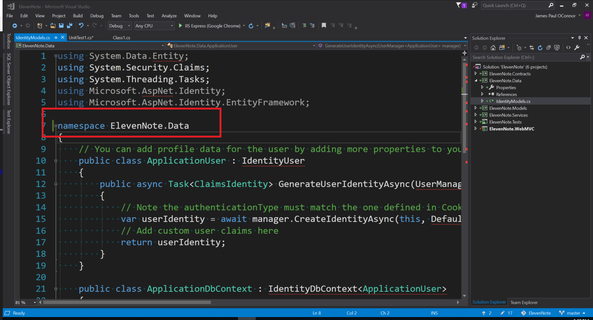
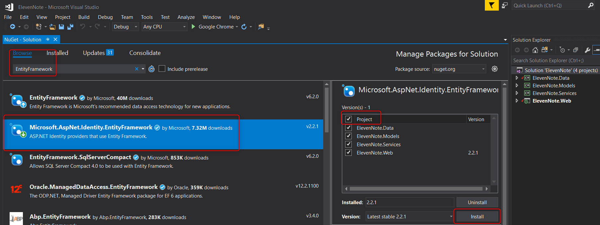
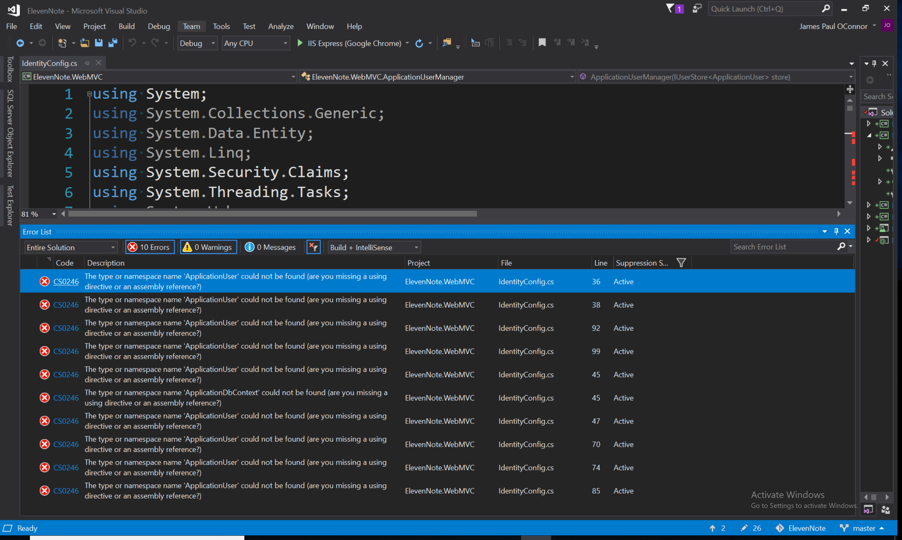

# 2.1: ENTITY FRAMEWORK, REFERENCES, AND USING STATEMENTS
---
In this module we'll address the errors caused by moving the `IdentityModels.cs` file to a new assembly. 

### Purpose
After moving `IdentityModels.cs` to **ElevenNote.Data** you should be seeing some errors. These errors are a result of us needing certain references and packages for our solution. We'll add those items now. Currently, the code in the **.WebMVC** layer can't see the `IdentityModels.cs`. It needs access. Also, the **.Data** layer does not have the Entity Framework package installed. `IdentityModels.cs` needs that package to operate.

### Assembly Name
The first thing we'll correct is the assembly name that accompanies the `IdentityModels.cs` file.

1. Go to the `IdentityModels.cs` file.
2. Update the namespace to align with our current namespace:

### Add Entity Framework to the Projects
Next, we'll install Entity Framework. Entity Framework (EF) is an object-relational mapper that enables .NET developers to work with relational data using domain-specific objects. In this app, Entity Framework will help us connect to our database, and it will allow us to complete CRUD operations in our database. 

Install EF by doing the following:

1. Right click on the solution and choose **Manage Nuget Packages for Solution**.
2. Note that it will sometimes default to the 'Installed' tab. 
3. Click the browse tab. In the search bar, browse for **EntityFramework**.
3. Choose **Microsoft.AspNet.Identity.EntityFramework**.
4. Click **Project**.
5. Click **Install**.

6. Close the NuGet Package Manager.

### Add References
We'll add a few references for our MVC project now. References, if you don't know, allow one assembly to access public classes in other assemblies. The web project needs to communicate with the other projects in our solution. As we shall soon see, it needs to know about the .Data layer, the .Services layer, and the .Models layer. This is done with references.

When adding references, it's smart to think with this formula:

"Does x assembly need to know about or use the y assembly?"

**Does the web layer need to know about the service layer?**
Yes, the web layer will use the service to query the db.

**Does the web layer need to know about the Data layer?**
Yes, the web layer needs the IdentityModels that we just moved.

**Does the service layer need to know about the WebMVC layer?**
No, the service layer will have the duty of querying the db. It doesn't care where the query is coming from.

We'll work with this questioning as we operate.

### Steps
Let's work with the references:
1. First, let's find the errors to fix by pressing `CTRL + SHIFT + b` to build the project. If you don't see the Error Output at the bottom, go to the View tab and choose `Error List`.
2. Use the `Error List` to troubleshoot and navigate to errors.
3. You should see a list of errors which may vary slightly from the screenshot below:

4. Right-click on **ElevenNote.WebMVC** and go to **Add -> Reference**
5. Click on **Projects -> Solution**
6. Select the ElevenNote.Data, ElevenNote.Services & ElevenNote.Models projects and click **OK**. You should see this view:

### Add Using Statements
Because we moved the `IdentityModels.cs` file from the WebMVC project to the **Data** project, we need to bring in using statements for the Data project.

1. Again, press`CTRL SHIFT B` to build the project
2. You should have more errors - see below for approximation:

3. Double click on the first error to go to the code with the error
4. Click on the error in the file and `CTRL .` to bring in the using statement at the top:

5. It should bring in the following using statement at the top of your file (your line #'s may differ)

6. `CTRL SHIFT B` again to build the project. By the way,`CTRL SHIFT B` saves everything first, and then builds a library for the project.
7. There should be more errors after building. To remove them, repeat the above process until all errors are gone.

Now might be a good time to back up your code: 

