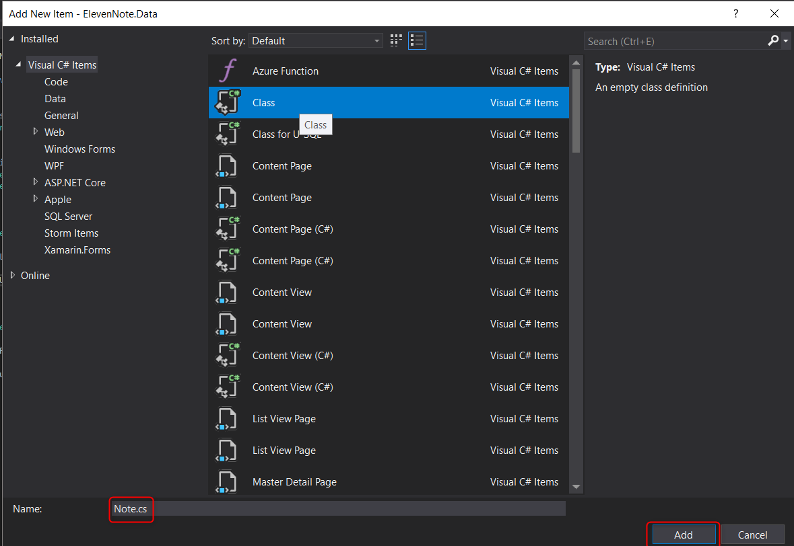

# PART 3: DATABASE SETUP
---
In this model will we set up our Note.cs class.

### 3.1: Entity Model
The entity model represents how we will set up data in our database. The properties we add to this class will be added as columns in our SQL table. This class will also be used by the service layer to persist data and query the database. More on that later. 

<hr />

### Steps
1. In the **Solution Explorer**, right click on **ElevenNote.Data**.
2. Select **Add -> Class** and name it `Note.cs`.

3. Make this class public. This will make it accessible to other assemblies. 
4. Add the properties inside of class:
```csharp
namespace ElevenNote.Data
{
    public class Note
    {
        public int NoteId { get; set; }
        public Guid OwnerId { get; set; }
        public string Title { get; set; }
        public string Content { get; set; }

        public DateTimeOffset CreatedUtc { get; set; }

        public DateTimeOffset? ModifiedUtc { get; set; }
    }
}
```
5. Now, above each of the properties, we need to add data annotations - we'll see [more info](3.1-Annotations.md) about data annotations in the next module.

```csharp
namespace ElevenNote.Data
{
    public class Note
    {
        [Key]
        public int NoteId { get; set; }

        [Required]
        public Guid OwnerId { get; set; }

        [Required]
        public string Title { get; set; }

        [Required]
        public string Content { get; set; }

        [Required]
        public DateTimeOffset CreatedUtc { get; set; }

        public DateTimeOffset? ModifiedUtc { get; set; }
    }
}
```
6. Click on one of the annotations and click on `CTRL .` to bring in the using statement for the annotations:


