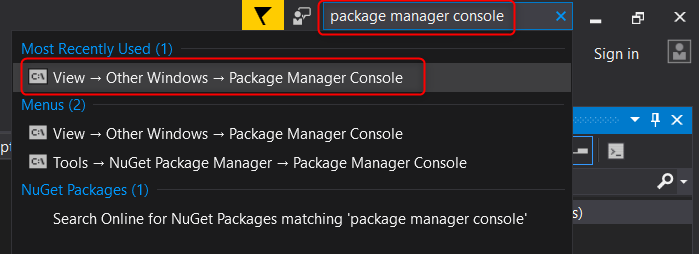

# 3.5: MIGRATIONS
---
In this module we'll introduce migrations.

### Purpose
We now have established our database, and it has been created by SQL Server. We can log in new users, write code to create notes, and keep building out our database. A common situation is to need to add more columns and tables to our database. Say for instance, we wanted to add a Summary property of type string to our `Note.cs` class. Well, we can't just force that property into the `Note.cs` class and have it start recording that data. We have to tell SQL Server that we are adding a column to our database.

As we'll see, if you add, remove, or change any of the properties in this file after you've run the app, you will need to run migrations to update the database structure.

### Migration Steps
These notes are intended to be a quick reference for adding migrations, when you want to add columns in your own projects. Again, don't do this now. Follow these steps later when you want to add a column to your database:

1. In the Quick Launch (top left), type in **'Package Manager Console'**

2. Make sure to change the Default Project to **ElevenNote.Data**

   - This is easy to forget, so in a few weeks when you do this again and get an error, it's probably because your default project is set to **ElevenNote.Web**
3. Type **Enable-Migrations**
4. Type **Add-Migration** and then a space and a brief note about what the migration is (similar to a git commit message). It does not need to be in quotes. 
5. Type **Update-Database**. 

