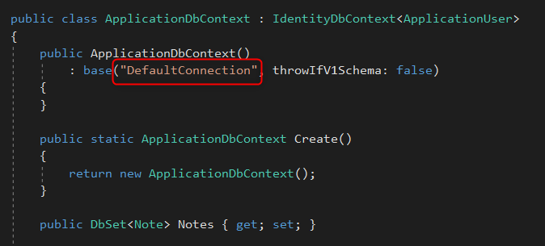
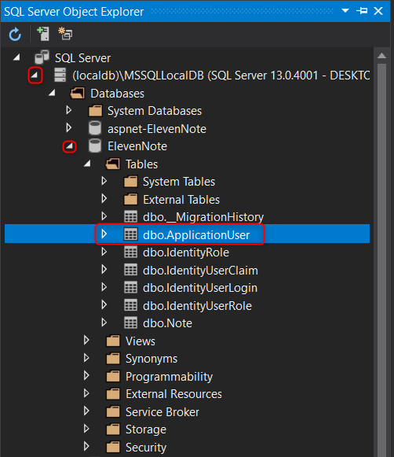
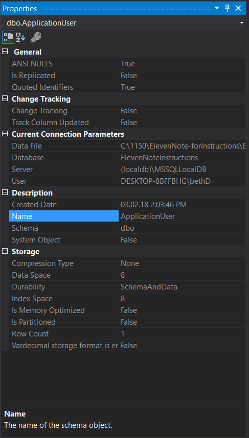

# 3.1: DATABASE AND CONNECTION STRING
---
In this module we'll talk about connection strings and complete our first migration for database set up.

<hr />

### Purpose
A connection string is a piece of code that helps us establish our initial connection to the database. The connection string includes the source database name and other parameters needed to establish the initial connection. For the next few steps we'll examine this important concept and get our database established.

### Connection String
First, let us show you where the connection string is established:
1. Go to the **ElevenNote.Web** assembly, and double click on the `Web.Config` file.
2. Look at the `<connectionStrings>` on line 13.
3. Notice the the name is `"DefaultConnection"`

4. Go to **ElevenNote.Data ->** `IdentityModels.cs`
5. In the `ApplicationDbContext` method, one of the arguments is `"DefaultConnection"`

6. This is how the application can communicate with the Web.Config file and persist application data.
7. Go back to **ElevenNote.Web ->** `Web.Config`
8. In the connection string, the name of the database is in two places. 

9. Take the following connection string code and paste it over the top of your existing connection string:
```xml
  <connectionStrings>
    <add name="DefaultConnection" connectionString="Data Source=(LocalDb)\MSSQLLocalDB;AttachDbFilename=|DataDirectory|\ElevenNote.mdf;Initial Catalog=ElevenNote;Integrated Security=True"
      providerName="System.Data.SqlClient" />
  </connectionStrings>
```

### Run the application
Again, the connection string helps us establish an initial connection to the database, so when we run the application, we will have our initial database created:
1. Run the application and register an account.
2. Make sure to remember the login/password you use to test with later.
3. In the top right of the application, you should be greeted with the email you entered


### Database
Let's show you how to view the data in the SQL Server Object Explorer.

1. In the **Quick Launch** (top right), type in 'SQL'
2. Find the **SQL Server Object Explorer** (you can also get this by going to **View -> SQL Server Object Explorer**)
3. Find your ElevenNote database and expand the **Tables** folder
4. Right click on `dbo.ApplicationUser` and select **View Data**

5. Checkout the data

6. Close the data tab
6. Right click on `dbo.ApplicationUser` and select **Properties**
7. Take a look at the table's properties

8. 


